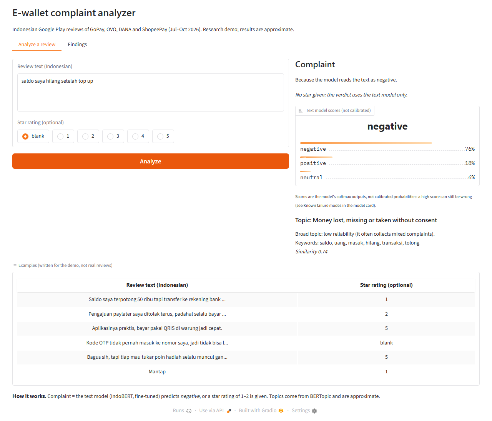
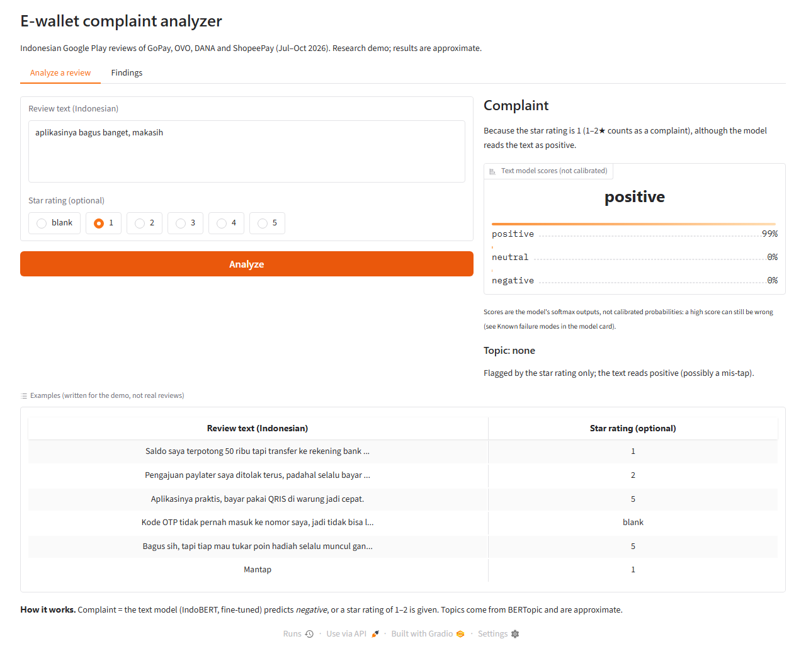
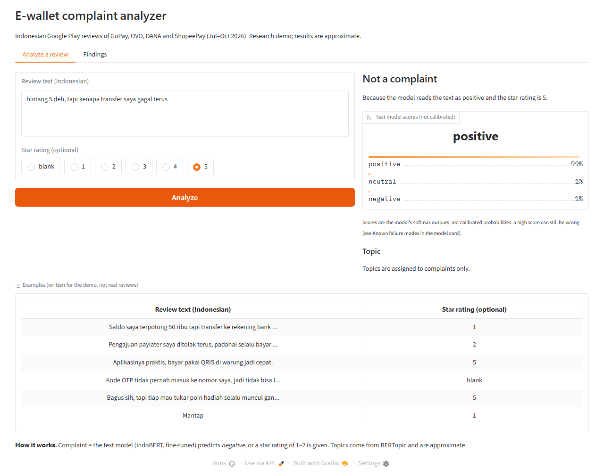
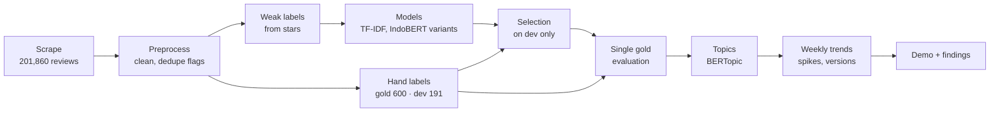

# What do users complain about in Indonesian e-wallet apps?

An NLP project on **201,860 Google Play reviews** of GoPay, OVO, DANA and ShopeePay (Jul 1 – Oct 3, 2026).
The business question: *what are users' main complaints per e-wallet, and how do they change over time?*
A fine-tuned IndoBERT model plus a simple star rule finds complaints with **F1 0.922** on 600 hand-labeled
reviews, against 0.822 for star ratings alone. Complaint levels differ a lot by app (OVO 78.4%, ShopeePay 12.5% of reviews).
Volume spikes turn out to be **single bad days** (outages, a reward-points event), not lasting shifts.

- **Findings page:** [huggingface.co/spaces/k08e24bryant/ewallet-complaint-findings](https://huggingface.co/spaces/k08e24bryant/ewallet-complaint-findings)
- **Model + model card:** [huggingface.co/k08e24bryant/indobert-ewallet-complaints](https://huggingface.co/k08e24bryant/indobert-ewallet-complaints)
- **Experiment tracking (W&B):** [wandb.ai/syarifsanad-institut-teknologi-sepuluh-nopember/ewallet-reviews](https://wandb.ai/syarifsanad-institut-teknologi-sepuluh-nopember/ewallet-reviews)
- **Live demo:** coming after Nov 10, 2026. Until then, run it locally: `uv run python app/app.py`

## Key results

Evaluated once on a held-out gold set of 600 reviews labeled from the text only (stars hidden);
numbers are reweighted to the population of unique review texts, with 95% bootstrap CIs.

| Metric | Result |
|---|---|
| Complaint F1, model + star rule | **0.922** [0.890, 0.948] vs **0.822** [0.789, 0.855] for stars alone (+0.099 [+0.071, +0.129]) |
| Complaint recall at the same precision | **0.876** vs **0.710**, precision 0.973 vs 0.977 (difference −0.004 [−0.019, +0.006]) |
| 4–5★ reviews that contain a complaint (unique texts) | **24.5%** [17.6, 31.5], about 1 in 4 |
| Label reliability (50 blind relabels) | Cohen's kappa **0.80** (3 classes), **0.90** (complaint vs not) |

## Headline findings

1. **Spikes are single bad days.** DANA's spikes were Jul 20 (5,565 reviews, 80.6% complaints), Sep 25 (12,023; 83.5%)
   and Oct 1 (8,707; 85.9%), against a median of about 830 reviews a day; GoPay's was Jul 28 (4,357; 81.2%). On Jul 20,
   "reward points cannot be redeemed" grew by 12.8 percentage points [11.8, 13.8] of DANA's complaints.
2. **ShopeePay's complaint share doubled for two consecutive weeks (one partial)**, without a volume spike:
   23.1% [21.6, 24.7] and 22.1% [20.5, 23.7], vs a median of 11.2% in Jul 6 – Sep 7. Two weeks are too few to call it a trend.
3. **Each app has its own main complaint.** Money lost or taken without consent is the most frequent topic for OVO
   (32.8% [31.4, 34.3] of its unique complaint texts), DANA Cicil defines DANA (10.2% [9.9, 10.6]), and loans/paylater stand out for ShopeePay
   (9.9% [8.9, 10.9]) and GoPay (7.9% [7.4, 8.4]). Topic labels are approximate (see Limitations).
4. **Overall complaint share per app** (complete weeks): OVO 78.4% [77.3, 79.4], DANA 37.9% [37.6, 38.2],
   GoPay 24.9% [24.5, 25.3], ShopeePay 12.5% [12.1, 12.9].

All findings with figures: [reports/phase7_findings.md](reports/phase7_findings.md).

## Demo

| Complaint with a topic | 1★ praise: star rule only | Known failure: praise + "tapi" |
|---|---|---|
|  |  |  |

## Method



**Evaluation design**

- **Gold vs dev.** The gold set (600 reviews, 50 per app × star group) was used once, at the end. All choices
  (label scheme, class weights, the star + model rule) were made on a separate dev set of 191 reviews.
- **Rules fixed before results.** The dev selection rule (best F1; prefer the simpler option within 0.02) and the
  topic-model decision rule (adopt the new topics only if a fresh fit check beats the old 37% "yes" rate) were written
  down before the numbers they decide on were computed.
- **Reweighting.** Labeled sets are stratified, so every metric is reweighted to the stratum sizes of the unique-text
  pool and reported with stratified bootstrap CIs; raw numbers are kept in the reports.

## Limitations and known failure modes

- **Topics are approximate:** in a fresh manual check, 40% [26, 55] of topic assignments were judged correct
  (52% for specific topics). Complaint shares are much more reliable than topic shares.
- **4–5★ complaints are hard:** the text model catches about half of them, and it reads reviews that open with praise
  and complain after "tapi" (but) as positive. English input is out of scope.
- **Star-rule false positives:** 1–2★ praise is counted as a complaint.
- **Reviews, not users:** people who write reviews are self-selected; shares describe reviews.

Details, examples and the "tapi" diagnostic: [model card](https://huggingface.co/k08e24bryant/indobert-ewallet-complaints#known-failure-modes).

## What I'd do next

- Hand-label a few hundred "praise + tapi + complaint" reviews and retrain with them (validated on a new dev set),
  since weak star labels teach the model the wrong answer for exactly these cases.
- Give short reviews a topic only when they name a problem; route the rest to "unspecified".
- Add topics that are still missing (slowness, admin fees), and calibrate the model scores.
- Re-run monthly to see whether ShopeePay's rise persists.

## Reproduce

Python 3.11 with [uv](https://docs.astral.sh/uv/); GPU training on an RTX 3060 Laptop GPU (6 GB VRAM).
Scraping returns current reviews, so a re-run will not match these exact numbers.

```bash
uv sync
uv run python -m src.scrape --app all                                   # 1 scrape
uv run python -m src.preprocess                                         # 2 clean + flags
uv run python -m src.label --config configs/label.yaml                  # 3 weak labels, gold sample, splits
uv run python -m src.gold --config configs/gold.yaml                    #   import gold labels
uv run python -m src.train_baseline --config configs/baseline.yaml      # 4 TF-IDF baseline
uv run python -m src.dev_set --config configs/dev.yaml                  # 5 dev set
uv run python -m src.train_indobert --config configs/indobert.yaml --label-scheme spec_3class --class-weights none
uv run python -m src.dev_select                                         #   selection on dev
uv run python -m src.gold_eval                                          #   single gold evaluation
uv run python -m src.predict                                            # 6 predictions + topics
uv run python -m src.topics --explore                                   #   first topic model (v1)
uv run python -m src.topics_v2 --compare                                #   embedding comparison
uv run python -m src.topics_v2 --version v3 --fit indo_sbert            #   brand-neutral refit (v3)
uv run python -m src.topics_v3 --apply
uv run python -m src.trends                                             # 7 trends
uv run pytest tests/ && uv run python app/app.py                        # 8 demo
```

Hand-labeling steps (gold, dev, topic names) read the workbooks in `data/`.

## Data and ethics

- Public Google Play reviews only. User names and profile images were never read or stored.
- The full scraped dataset is **not** published. The repository does include the hand-labeled samples and the review
  texts used for topic review (a few thousand texts, with Google Play review IDs but no user information).
- Results describe reviews, not individual users, and are not meant for decisions about individuals.

## Project structure

```
app/        Gradio demo (self-contained, CPU)
configs/    one YAML config per step (seeds, paths, hyperparameters)
data/       hand-labeled gold, dev and topic workbooks (raw and processed data not tracked)
docs/       screenshots
hub/        model card, Space and findings-page sources
reports/    JSON results, findings and figures per phase
scripts/    publishing, checks, benchmarks
src/        pipeline code (scrape → trends)
tests/      demo parity tests
```
